<p align="center">
  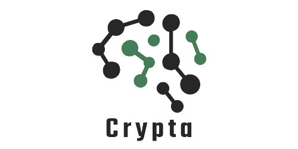
</p>

## Project Description

An automated digital forensics and incident response system designed for anomaly detection and pattern recognition across system data and network activity. The tool integrates AI/ML models to classify system risk levels, identify indicators of compromise (IoCs), and generate actionable insights from forensic disk images, memory dumps, and network traffic.

### Key Features

- **Automated Forensic Data Collection**: Automates FTK Imager, Volatility, RegRipper, and Sysinternals Suite through Python libraries (PyEWF, MemProcFS, Regipy, and PSUtil) for forensic images, memory dumps, registry hives, and background processes.
- **IoC Identification**: Utilizes custom YARA rules and MISP databases for detecting file anomalies and correlating known IoCs.
- **Network Traffic Analysis**: Leverages Wireshark and Scapy to analyze packet captures and identify suspicious network activities.
- **AI/ML Integration**: Implements TensorFlow models for anomaly detection and risk classification, offering investigators prioritized analysis of critical artifacts.
- **Cross-Platform Dashboards**: Provides real-time data visualization, interactive timelines, and detailed reports with export options in PDF, JSON, and CSV formats.
- **Scalable Architecture**: Built with FastAPI, Next.js, and Flutter, ensuring high performance and easy deployment across environments.

Additionally, the tool supports live drive detection, allowing investigators to connect drives and perform real-time forensic analysis. It also features a chatbot that provides detailed explanations of detected anomalies, offering further insights.

## Project Milestones

### Completed:
- [x] Automate disk image processing
- [x] Analyze system logs using YARA rules
  - [x] Display system logs results on the dashboard
- [x] Analyze network traffic with Scapy
  - [ ] Display network traffic results on the dashboard
- [x] Develop ML model for risk type and risk level categorization
- [x] Develop ML model for network traffic prediction
- [x] Generate reports in PDF, CSV, and JSON formats
- [x] Build interactive graphs
- [x] Detect external drives

### In Progress:
- [ ] Automate memory dumping
- [ ] Train network traffic ML model to identify more attack patterns
- [ ] Integrate MISP IoC database for improved threat identification 
- [ ] Analyze registry hives
  - [ ] Display registry results on the dashboard
  - [ ] Develop ML model for registry hive analysis
- [ ] Analyze system running processes
  - [ ] Display running processes results on the dashboard
  - [ ] Develop ML model for running processes analysis
- [ ] Integrate blockchain technology for secure and immutable audit trails

### Other:
- [ ] Support desktop app download
- [ ] Implement responsive web design
- [ ] Improve loading animations
- [ ] Add chatbot functionality and background image

### Bugs:
- [ ] Add YARA analysis support for additional file types: .doc, .docx, .xls, .xlsx, .ppt, .pptx
- [ ] Implement multithreading for faster file and folder scanning within disk images and memory dumps

## Project Architecture

<p align="center">
  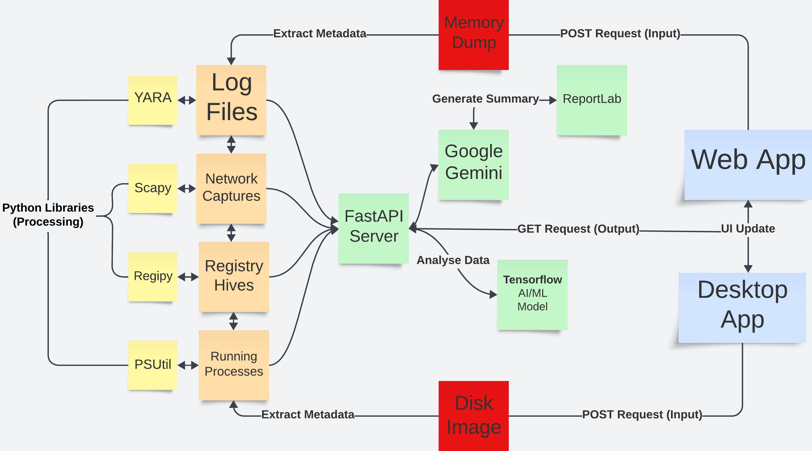
</p>

---

1. **[Log Files](https://github.com/areebahmeddd/Crypta/blob/main/app/file.py)**: Uses the `yara-python` library to automate YARA rule-based file classification, scanning log files for malicious patterns and indicators of compromise.

2. **[Network Captures](https://github.com/areebahmeddd/Crypta/blob/main/app/network.py)**: Utilizes the `Scapy` library to automate network traffic analysis, replacing manual tasks typically handled by Wireshark. It looks for specific packets such as HTTP Requests, DNS Queries, and IP Packets to identify anomalies in packet captures.

3. **[Registry Hives](https://github.com/areebahmeddd/Crypta/blob/main/app/registry.py)**: Employs the `Regipy` library to automate the tasks of Regripper, extracting and analyzing Windows registry hives for forensic investigation of system activity.

4. **[Running Processes](https://github.com/areebahmeddd/Crypta/blob/main/app/process.py)**: Leverages `PSUtil` to automate the functionalities of Sysinternals Suite, monitoring and collecting data on running processes, system performance, and resource usage.

5. **[FastAPI](https://github.com/areebahmeddd/Crypta/blob/main/app/run.py)**: Acts as the core backend framework, handling data ingestion, analysis requests, and communication between the various forensic modules and front-end interfaces, ensuring efficient processing.

6. **[Google Gemini](https://github.com/areebahmeddd/Crypta/blob/main/app/gemini.py)**: Integrates with the system to analyze processed file data using a prompt, generating detailed summaries of findings through `ReportLab`, which are then exported in report formats (PDF, CSV, and JSON).

7. **[TensorFlow AI/ML Model](https://github.com/areebahmeddd/Crypta/tree/main/app/models)**: Trained to detect anomalies, classify risks, and recognize patterns within the ingested forensic data, supporting advanced automated analysis and decision-making.

8. **[Web App](https://github.com/areebahmeddd/Crypta/tree/main/web-app)**: Allows users to input various forensic artifacts such as regular files, folders, memory dumps, or disk images. It provides a real-time interface for investigators to interact with the analysis engine.

9. **[Desktop App](https://github.com/areebahmeddd/Crypta/tree/main/desktop-app)**: Provides cross-platform compatibility with enhanced security features compared to web browsers, enabling secure input and analysis of forensic data with better local system access.

## ML Model Design

1. **Network Traffic Classification Model**:
   - We utilized a pre-trained XGBoost classifier from `scikit-learn` to evaluate network traffic patterns.
   - The model was optimized for multiclass classification using log loss as the evaluation metric.
   - Model performance indicates no signs of overfitting, as the training and validation results are closely aligned. (Shown in Graph 1)
   - Achieved 98% accuracy on both the training set and the new test dataset, ensuring robust generalization.

<p align="center">
  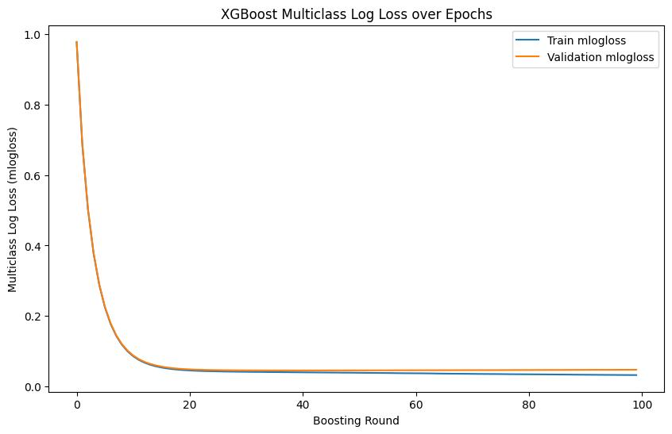
  <br>
  XGBoost Multiclass Log Loss stabilizes over boosting rounds for training and validation datasets
</p>

2. **Risk Level and Type Classification Model**:
   - Implemented an RNN model with tokenization and GloVe embedding (100-dimensional vector embeddings) for text data.
   - The LSTM layer is used to capture temporal patterns in the data, enabling better classification of risk types.
   - A dropout layer was incorporated to prevent overfitting, leading to close alignment between training and validation data. (Shown in Graph 2 and Graph 3)
   - The model achieved 95% accuracy, demonstrating strong performance across the dataset.

<p align="center">
  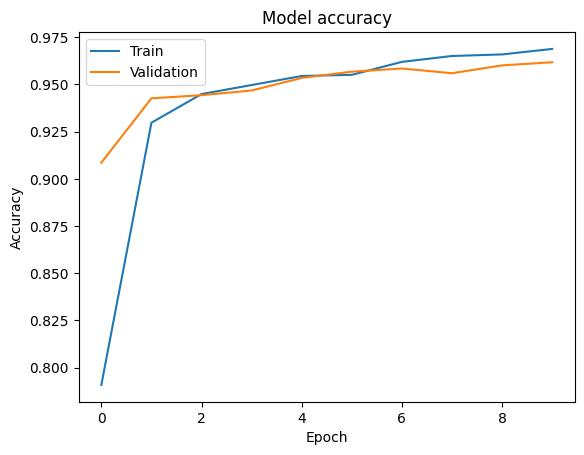
  <br>
  Model accuracy over training epochs for both training and validation datasets
</p>

<p align="center">
  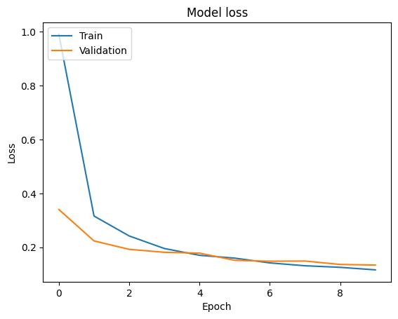
  <br>
    Model loss over training epochs for both training and validation datasets
</p>

## Project Vision

The project is designed to address key cybersecurity challenges faced by India, targeting specific threats such as large-scale financial fraud, ransomware attacks on critical infrastructure, and politically motivated cyber-attacks. For instance, India has witnessed increasing attacks on its banking sector, with incidents like the 2018 Cosmos Bank cyber heist, where ₹94 crores were siphoned off through malware. Additionally, high-profile incidents such as the 2020 ransomware attack on the Kundankulam Nuclear Power Plant, which threatened national infrastructure, highlight the critical need for enhanced forensic capabilities. The tool’s AI/ML models are trained on these major incidents, ensuring that it can detect patterns from both historic and emerging threats. By focusing on these pressing issues, the tool offers law enforcement and cybersecurity teams a solution that is directly relevant to India’s current cybersecurity landscape, speeding up investigations and reducing risks.

Looking ahead, the tool is designed with global scalability in mind, aiming to support the investigation of international cybercrimes. It will provide personalized workflows tailored to different types of cyber-attacks, such as cross-border ransomware campaigns or large-scale data breaches. The platform consolidates major forensic tools into one interface, offering customization options for investigators to adapt the tool based on specific cases, making it a comprehensive solution for both domestic and global cybersecurity challenges.

## Getting Started

Follow these steps to set up and run the Crypta system on your local machine, or you can watch the [demo video](https://youtube.com/watch?v=ToXUq-NSkUg).

### Installation

#### Option 1: Docker Setup

1. **Pull the Docker Image**:
   ```bash
   docker pull areebahmeddd/crypta-backend:latest
   ```

2. **Run the Docker Container**:
   ```bash
   docker run -p 8000:8000 -e GEMINI_API_KEY=your_gemini_api_key areebahmeddd/crypta-backend:latest
   ```

   - Replace `your_gemini_api_key` with your actual API key.

#### Option 2: Local Setup

1. **Fork the Repository**:
   - Go to the [Crypta repository](https://github.com/areebahmeddd/Crypta) and click "Fork" to create a copy under your GitHub account.

2. **Clone the Repository**:
   ```bash
   git clone https://github.com/<your-username>/Crypta.git
   ```

3. **Create a Virtual Environment (Optional but Recommended)**:
   ```bash
   python -m venv .venv
   ```

4. **Activate the Virtual Environment**:
   - **Windows**:
     ```bash
     .venv\Scripts\activate
     ```
   - **macOS and Linux**:
     ```bash
     source .venv/bin/activate
     ```

5. **Install Dependencies**:
   ```bash
   pip install -r requirements.txt
   ```

6. **Set Up Environment Variables**:
   - Create a `.env` file in the project root directory with the following template:
     ```ini
     GEMINI_API_KEY=your_gemini_api_key
     ```

7. **Run the Python Application**:
   ```bash
   python app/run.py
   ```

## Usage

After setting up the application using Docker or running it locally, you can verify that it's working by making a simple HTTP GET request.

1. **Using a Web Browser or HTTP Client**

   Open your web browser or use an HTTP client like Postman and navigate to:
   ```
   http://localhost:8000/
   ```

   You should see a response confirming the backend server is running, such as:
   ```json
   {
     "message": "Backend server is running"
   }
   ```

2. **Using `curl`**

   Alternatively, you can test the server from the command line with a `curl` GET request:
   ```bash
   curl http://localhost:8000/
   ```

   This should return a similar JSON response confirming that the server is active.

## Project Preview

### Web Application UI

<p align="center">
  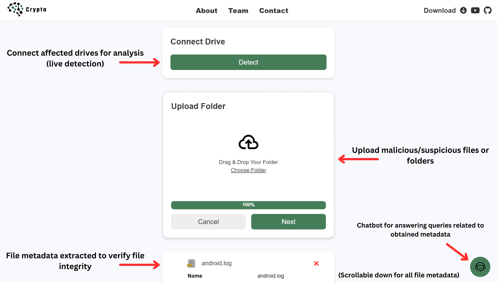
  <br>
  Landing Page
</p>

---

<p align="center">
  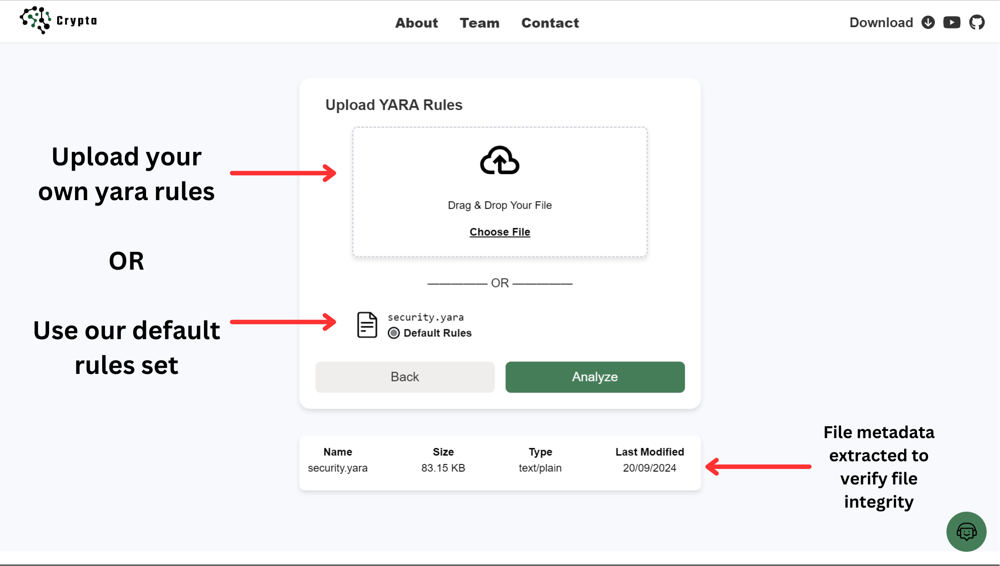
  <br>
  Upload Page
</p>

---

<p align="center">
  
  <br>
  Summary Page (File Summary)
</p>

---

<p align="center">
  
  <br>
  Summary Page (Vulnerability Summary)
</p>

---

<p align="center">
  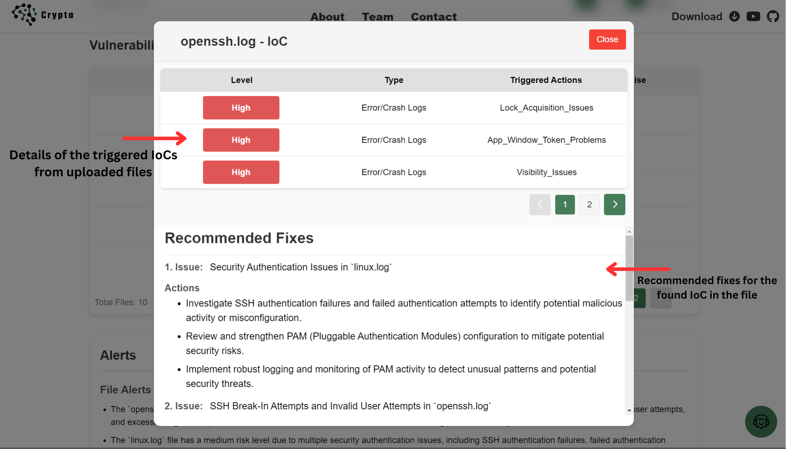
  <br>
  Modal Page (Detailed IoCs)
</p>

---

<p align="center">
  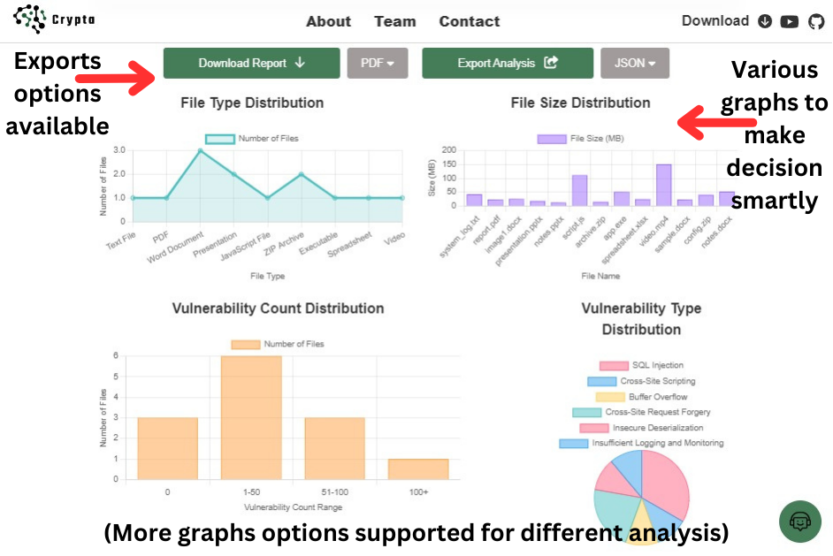
  <br>
  Graph Page
</p>

### Flutter Application UI

<p align="center">
  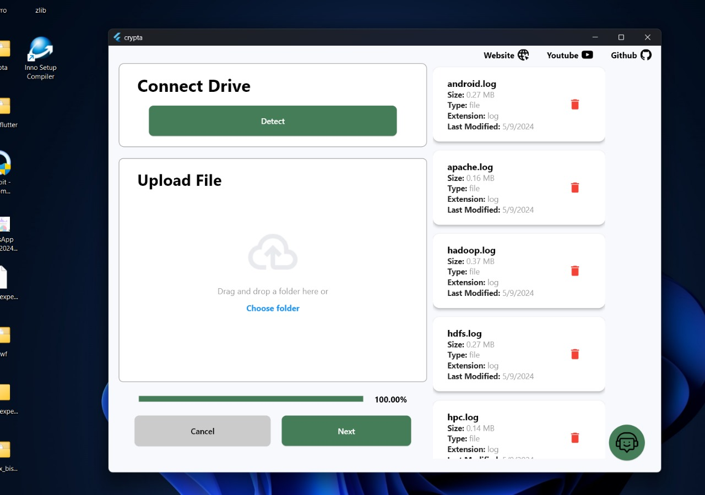
  <br>
  Landing Page
</p>

---

<p align="center">
  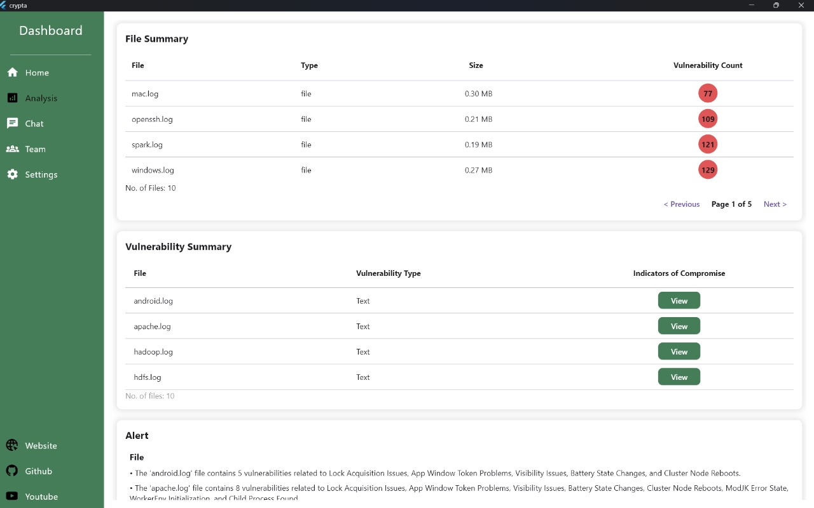
  <br>
  Dashboard Page (Overall Summary)
</p>

---

<p align="center">
  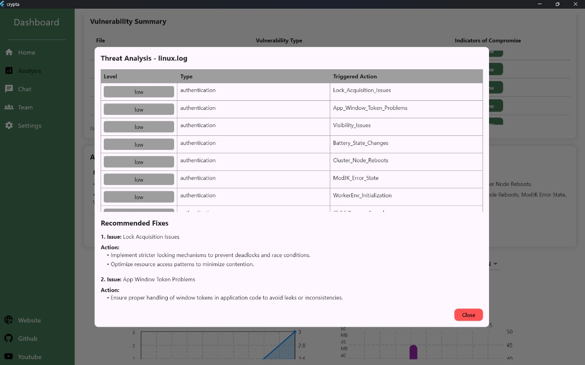
  <br>
  Dashboard Page (Detailed IoCs)
</p>

## License

This project is licensed under the [Apache License 2.0](https://github.com/areebahmeddd/Crypta/blob/main/LICENSE).

## Authors

- [Areeb Ahmed](https://github.com/areebahmeddd)
- [Shivansh Karan](https://github.com/SpaceTesla)
- [Avantika Kesarwani](https://github.com/avii09)
- [Yuktha PS](https://github.com/psyuktha)
- [Shashwat Kumar](https://github.com/shashwat6204)
- [Rishi Chirchi](https://github.com/rishichirchi)
